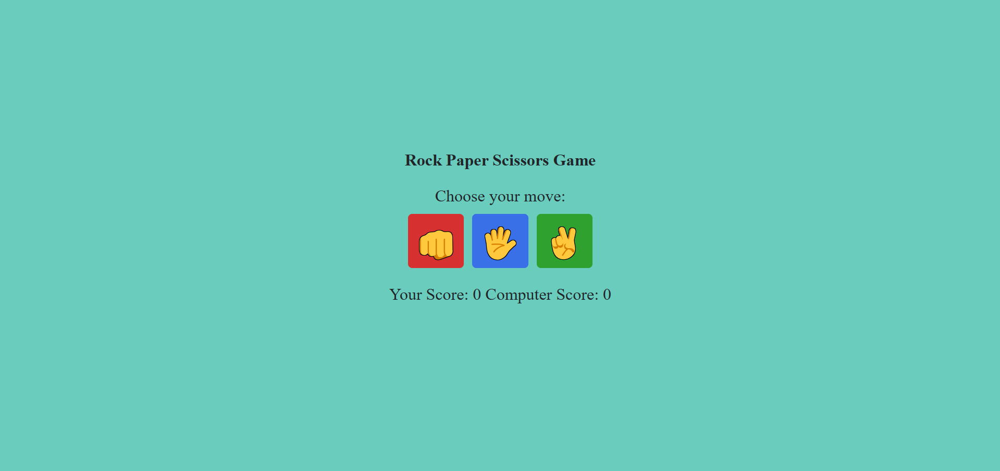

# Rock Paper Scissors Game

This is a simple **Rock Paper Scissors** game where you can play against the computer. The game tracks your score and the computer's score, displaying the result after each round.

## Features

- Play **Rock**, **Paper**, or **Scissors** against the computer.
- Real-time score tracking for both the player and the computer.
- Interactive UI with animated buttons.
- Simple game logic to determine win, lose, or draw.

## Technologies Used

- **HTML**: Used for the structure of the game.
- **CSS**: For styling the user interface.
- **JavaScript**: Handles the game logic and interactions.

## How to Play

1. Choose your move by clicking on the **Rock**, **Paper**, or **Scissors** buttons.
2. The computer will randomly select a move.
3. The result of the round (Win, Lose, or Draw) will be displayed.
4. The score will be updated accordingly.

## Installation

To run this project locally, follow these steps:

1. Clone the repository:
    ```bash
    git clone https://github.com/tkyDevs/rock-paper-scissors.git
    ```
2. Navigate to the project folder.
3. Open the index.html file in your browser to start playing.

## Screenshot
;

## License
This project is open-source and available under the MIT License.